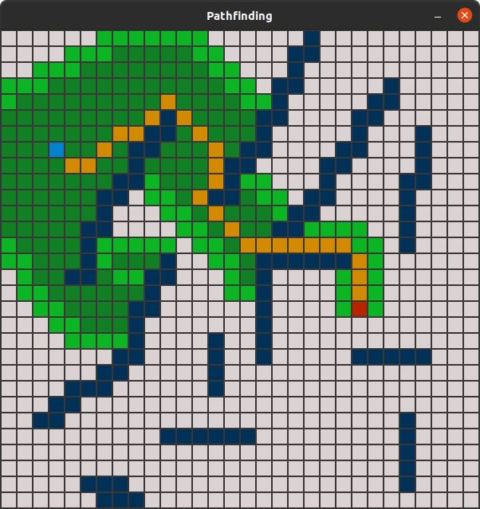

# Pathfinding

This project is my first attempt to implement a Pathfinding Visualizer.<br/>For now it contains a basic implementation of the A* algorithm.

Start and Endnode and Border are dynamicaly assignable at startup.<br/>
The program then visualizes the algorithm with a predefined sleeprate.


## Example



## Dependency

```
sudo apt-get install libsfml-dev
```

## Compile

```bash
/usr/bin/g++ -g ./main.cpp -o ./main -lsfml-graphics -lsfml-window -lsfml-system
```

