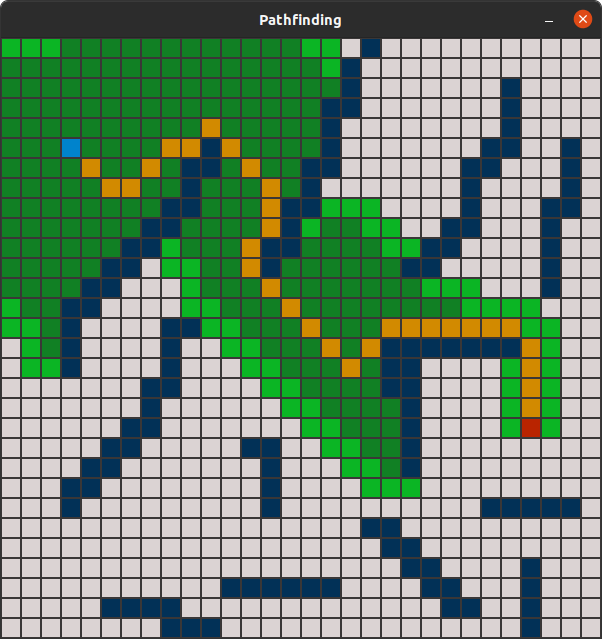

# Pathfinding

This project is my first attempt to implement a Pathfinding Visualizer.<br/>
For now it contains a basic implementation of the A* algorithm.

Start and Endnode and Border are dynamicaly assignable at startup.<br/>
The program then visualizes the algorithm with a predefined sleeprate.


## Example




## Dependency

```bash
sudo apt-get install libsfml-dev
```

## Compile

```bash
/usr/bin/g++ -g ./main.cpp -o ./main -lsfml-graphics -lsfml-window -lsfml-system
```

## Usage

Following parameters are available:

<size> (int) to specify x and y size for a new grid.
<filepath> (string) a relative path to a save file (see below).

Note: You cannot use both parameters at once, as the size is saved in the save file.


## Save file

After painting the grid, the programm saves your grid configuration to a save file called "newgrid.txt".<br/>
If this file already exists it does not get overwritten.<br/>
Specify a file to open on startup and load a saved grid:
```bash
./main newgrid.txt
```
If you have downloaded the repository the file "examplegrid.txt" holds the config for the grid you can see above.